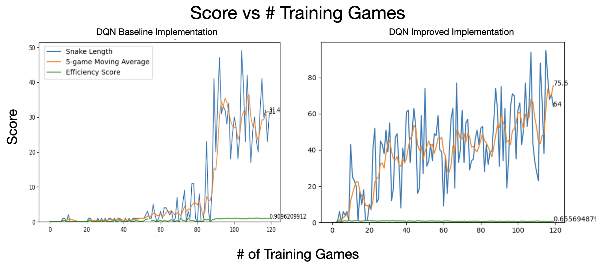

## Overview

This repo instantiates a Deep-Q-Network (DQN) Reinforcement Learning (RL) agent to play the game Snake. The original infrastructure is sourced from patrickloeber/snake-ai-pytorch (thanks!).

This project was completed to understand DQN from the ground-up while aiming to make the RL agent more performant.

As a result of code improvements (training recipe and model architecture changes), the snake agent is **~2x more performant** than the base version, as shown below.

  

On the left hand side is the <em>Base Performance</em> (performance of patrickloeber/snake-ai-pytorch).
 
On the right hand side is the <em>Improved Performance</em> (performance after changes in this repo).
  

The learned policy is better performing at the cost of learning to be more cautious: the snake efficiency slightly decreases in the improved veresion, as the original agent was lower-scoring but more efficient (took more direct paths to the food) whereas the improved agent snake learns a different policy with a lower efficiency score albeit much higher scoring (learning to be more cautious about getting trapped in a loop and killing itself).

After improving the QNet neural network architecture, creating richer state data, improving the training
recipe, and systematically exploring training/data related hyperparameters, we see strong performance improvement from the baseline DQN to the optimized DQN 
implementation. In particular, the optimized implementation has the following differences:
  * <em>Faster Learning</em>: the baseline agent only learns when the epsilon for epsilon-greedy policy has sufficiently decayed (around Game 80/120), whereas the optimized agent 
      learns much faster and reaches the same approximate performance around Game 25/120.  
  * <em>Consistent Learning</em>: the baseline agent plateus after epsilon decay (with the same performance from Game 80 to final Game 120), whereas the optimized agent 
      continues to learn from its newly collected experience with a consistent positive trend in 5-game-moving-average of Snake length.  
  * <em>Higher Performance, with greater caution</em>: the baseline agent has a high score of 49 and a final 5-game-moving-average of 31.4, whereas the optimized agent
      has a high score of 96 and a final 5-game-moving-average of 75.5. At the same time, the optimized agent is "less efficient" as it takes more frames to get to the food
      compared to the baseline agent (but does so in order to be better rewarded for longer Snake lengths and better survivability).

## Codebase Summary

proj/agent_train_pipeline.py
* Instantiates multiple instances of *AgentTrainer* class specified in proj/agent.py
* Allows for multi-threaded hyperparameter optimization

proj/agent.py
* Core RL agent implementation with DQN algorithm and experience replay
* Features sophisticated state representation combining food direction and local obstacle visibility
* Implements epsilon-greedy exploration with configurable decay schedules
* Contains AgentTrainer class orchestrating the complete training pipeline with performance tracking

proj/model.py
* Neural network architecture (QNet) with dual-path processing for DQN implementation
* Combines fully connected layers for compass/direction data with convolutional layers for spatial obstacle detection
* Includes QTrainer class with Adam optimizer, learning rate scheduling, and MSE loss for Q-learning updates

proj/game.py
* Enhanced Snake game implementation optimized for AI training (SnakeGameAI class)
* Supports both interactive and non-interactive modes with configurable parameters
* Implements action-based movement system compatible with reinforcement learning agents
* Includes collision detection, reward system (+10 food, -10 game over), and timeout mechanisms

proj/snake_game_human.py
* Basic Snake game implementation for human players using pygame
* Features keyboard controls (arrow keys) for snake movement and real-time gameplay
* Provides foundation for game mechanics later adapted for AI training

proj/helper.py
* Utility functions for real-time plotting of training metrics
* Displays snake length, moving averages, and efficiency scores during training
* Supports both interactive and final plot visualization modes

proj/inference.py
* Pre-trained model inference and evaluation framework
* Loads saved model weights to run the trained snake agent without further training
* Provides performance evaluation metrics for trained agents over multiple test games

proj/model/*
* Directory containing saved PyTorch model weights and checkpoints
* Stores the trained QNet neural network parameters (model.pth) for inference
* Houses the best-performing agent models discovered through hyperparameter optimization

analysis/*
* Jupyter notebooks containing comprehensive hyperparameter search results and analysis
* Statistical evaluation of 1,944 different agent configurations across multiple training phases
* Performance comparison studies identifying optimal parameter combinations for DQN training
* Includes data visualization and parameter correlation analysis for model optimization

imgs/*
* Training performance visualization assets and comparison charts
* Contains baseline vs improved agent performance plots used in project documentation
* Stores generated training metrics graphs and model comparison images

