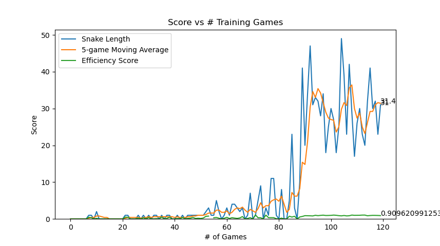
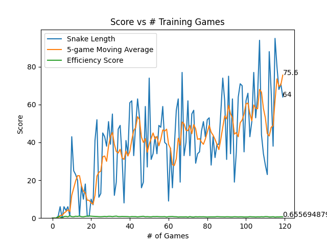

## Overview

This repo instantiates a Deep-Q-Network (DQN) Reinforcement Learning (RL) agent to play the game Snake. The original infrastructure is sourced from patrickloeber/snake-ai-pytorch (thanks!).

This project was completed to understand DQN from the ground-up while aiming to make the RL agent more performant.

As a result of code improvements (training recipe and model architecture changes), the snake agent is **~2x more performant** than the base version, as shown below.

  
  &#8594;
  

On the left hand side is the *Base Performance* (performance of patrickloeber/snake-ai-pytorch).
 
On the right hand side is the *Improved Performance* (performance after changes in this repo).
  

The learned policy is better performing at the cost of learning to be more cautious: the snake efficiency slightly decreases in the improved veresion, as the original agent was lower-scoring but more efficient (took more direct paths to the food) whereas the improved agent snake learns a different policy with a lower efficiency score albeit much higher scoring (learning to be more cautious about getting trapped in a loop and killing itself).

## Codebase
proj/agent_train_pipeline.py
* Instantiates multiple instances of *AgentTrainer* class specified in proj/agent.py
* Allows for multi-threaded hyperparameter optimization

