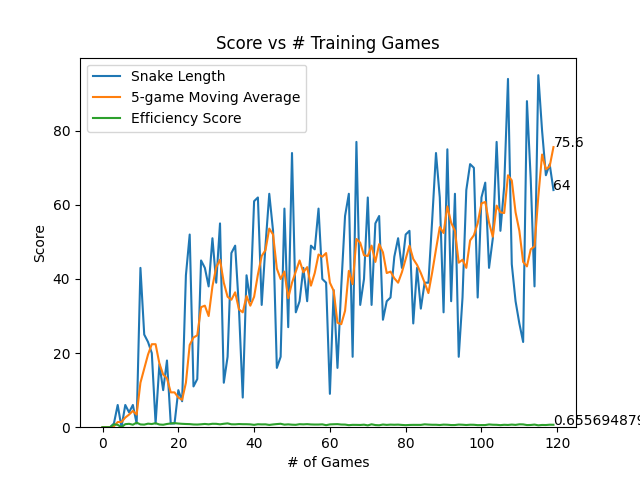

## Intro

This repo instantiates a Deep-Q-Network (DQN) Reinforcement Learning (RL) agent to play the game Snake. The original infrastructure is sourced from patrickloeber/snake-ai-pytorch (thanks!).

This project was completed to understand DQN from the ground-up while aiming to make the RL agent more performant.

  
  &#8594;
  

  &nbsp;&nbsp;&nbsp;&nbsp;&nbsp;&nbsp;&nbsp;&nbsp;&nbsp;&nbsp;&nbsp;&nbsp;&nbsp;&nbsp;&nbsp;&nbsp;&nbsp;&nbsp;&nbsp;&nbsp;&nbsp;&nbsp;     
  Base Performance (no training/model changes) 
  &nbsp;&nbsp;&nbsp;&nbsp;&nbsp;&nbsp;&nbsp;&nbsp;&nbsp;&nbsp;&nbsp;&nbsp;&nbsp;&nbsp;&nbsp;&nbsp;&nbsp;&nbsp;&nbsp;&nbsp;&nbsp;&nbsp;&nbsp;&nbsp;&nbsp;&nbsp;&nbsp;&nbsp;&nbsp;&nbsp;&nbsp;&nbsp;      
  Improved Performance (see below)

As a result of changes, the agent performs much better than the base model, and training is relatively much more stable (although there is still work to be done in stability). 
Interestingly enough, the original agent was lower-scoring but more efficient (took more direct paths to the food) whereas the improved agent snake learns a different policy with a lower efficiency score albeit much higher scoring. This is seemingly because the agent is more cautious about getting trapped in a loop and killing itself).   
